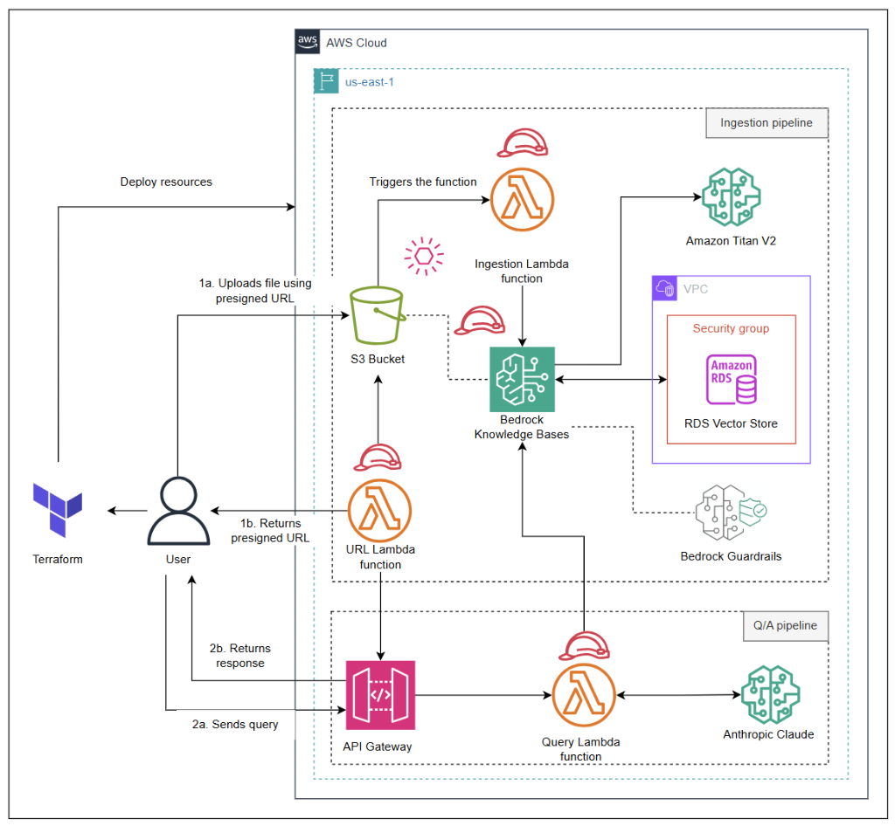

# Generative AI Document Ingestion and Q/A Pipeline

This project deploys a complete, serverless Generative AI solution on AWS using **Terraform**. It establishes two robust pipelines: one for document ingestion and indexing, and another for intelligent question answering (Q/A) using Amazon Bedrock.

## Architecture



## Overview

Managing resources for Generative AI workflows manually can be complex and error-prone. This project uses Infrastructure as Code (IaC) to ensure consistency, repeatability, and scalability.

The solution consists of:

1.  **Document Ingestion Pipeline**:
    *   **Amazon S3**: Stores source documents.
    *   **Amazon RDS (PostgreSQL with pgvector)**: Stores vector embeddings.
    *   **Amazon Bedrock Knowledge Base**: Indexes and manages the data.
    *   **AWS Lambda**: Automatically synchronizes the Knowledge Base when new files are uploaded.
    *   **Amazon API Gateway**: Provides presigned URLs for secure document uploads.

2.  **Question/Answering Pipeline**:
    *   **AWS Lambda**: Processes user queries against the Knowledge Base.
    *   **Amazon Bedrock Guardrails**: Ensures safe and responsible AI responses.
    *   **Amazon API Gateway**: Exposes the Q/A functionality via an API endpoint.

## Key Features

*   **Automated Verification**: Infrastructure is provisioned and managed via Terraform.
*   **Serverless**: Uses Lambda and serverless RDS for scalability and reduced operational overhead.
*   **Secure Ingestion**: Presigned URLs allow secure direct-to-S3 uploads.
*   **Responsible AI**: Integrated Guardrails to filter and manage model outputs.
*   **Efficient Retrieval**: Uses vector embeddings for semantic search and retrieval.

## Deployment

The entire infrastructure is defined in the `terraform` directory.

### Prerequisites

*   AWS CLI configured with appropriate permissions.
*   Terraform installed.

### Steps

1.  Navigate to the terraform directory:
    ```bash
    cd terraform
    ```
2.  Initialize Terraform:
    ```bash
    terraform init
    ```
3.  Plan the deployment:
    ```bash
    terraform plan
    ```
4.  Apply the configuration:
    ```bash
    terraform apply
    ```

## Demo

[Link to Demo Video](https://example.com)

## Files Included

*   `terraform/`: Contains all .tf files for the infrastructure.
*   `terraform/modules/`: Reusable Terraform modules for specific components.
