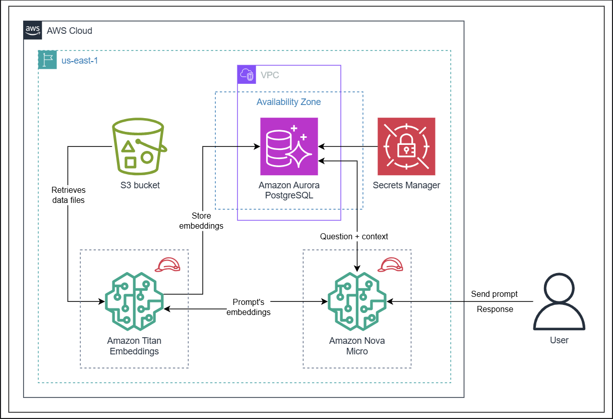

# Retrieval-Augmented Generation (RAG) with Amazon Bedrock

This project implements a Retrieval-Augmented Generation (RAG) system using AWS managed services. It leverages Amazon Bedrock for generative AI capabilities and Amazon Aurora PostgreSQL as a vector store to provide accurate, context-aware responses.

## Architecture

You can watch the [demo video here](https://youtu.be/ZSLhkQjB87Y).

## Project Overview

The system is designed to ingest documents, generate vector embeddings, and store them in a vector database. When a user asks a question, the system retrieves relevant information from the knowledge base and uses a Large Language Model (LLM) to generate a precise answer.

## Key Components & Technologies

### 1. Vector Database (Amazon Aurora PostgreSQL)
We use Amazon Aurora PostgreSQL optimized with `pgvector` to store high-dimensional vector embeddings.

**Schema Details:**
- **Table**: `bedrock_integration.bedrock_kb`
- **Columns**:
  - `id`: Unique UUID for each record.
  - `embedding`: Vector(256) column to store the semantic representation of text chunks.
  - `chunks`: The actual text content used for context.
  - `metadata`: JSON field for storing source attribution and other properties.

**Indexing Strategies:**
- **HNSW (Hierarchical Navigable Small World)**: Implemented on the `embedding` column to enable ultra-fast approximate nearest neighbor similarity searches.
- **GIN (Generalized Inverted Index)**: Applied to the `chunks` column to support efficient keyword-based filtering and full-text search.

### 2. Amazon Bedrock Knowledge Base
- **Titan Text Embeddings V2**: The model used to convert text documents into 256-dimensional vectors.
- **Managed RAG Pipeline**: Bedrock handles the ingestion, chunking, and embedding generation automatically.

### 3. Generative Model & Orchestration
- **Foundation Model**: Uses models like **Amazon Titan Text Premier** or **Nova Micro** to generate human-like responses based on the retrieved context.
- **AWS Lambda**: Serves as the compute layer to process requests and invoke the Bedrock Agents API.

## How It Works

1.  **Ingestion**: Documents (PDFs, etc.) are uploaded to S3. Bedrock chunks the text and generates embeddings using the Titan Embeddings model.
2.  **Storage**: These embeddings are stored in the Aurora PostgreSQL `bedrock_kb` table.
3.  **Retrieval**: When a query is received, it is converted into a vector. The database finds the most similar chunks using the HNSW index.
4.  **Generation**: The retrieved chunks are passed to the LLM (via Bedrock), which answers the query using the provided context.
