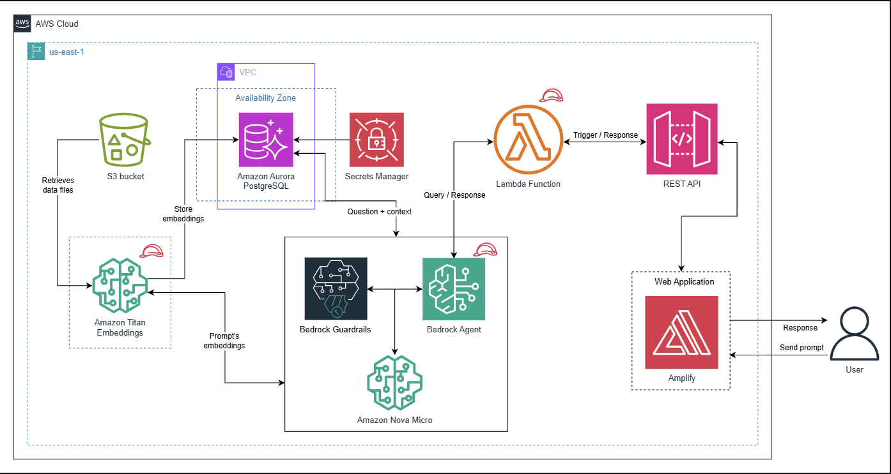
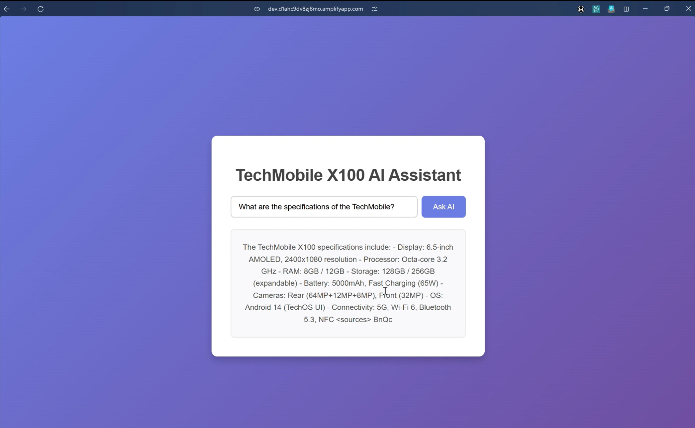

# Serverless GenAI QA App with Amazon Bedrock

This project demonstrates how to build a Serverless Generative AI Question-Answering application using Amazon Bedrock, Amazon Aurora PostgreSQL, and AWS Lambda.

## Architecture

You can watch the [demo video here](https://youtu.be/Z5Pbr6rkqng).

## Project Overview

The goal of this project is to create a Retrieval-Augmented Generation (RAG) application that allows users to query a knowledge base. The application uses Amazon Bedrock for the foundation models and Amazon Aurora PostgreSQL has the vector store.

## Technical Deep Dive

### Database Schema (Amazon Aurora PostgreSQL)

The vector store is implemented using the `pgvector` extension on Amazon Aurora PostgreSQL.

-   **Schema**: `bedrock_integration`
-   **Table**: `bedrock_kb`
    -   `id` (UUID): Unique identifier.
    -   `embedding` (VECTOR(256)): Stores the vector embeddings of the text chunks.
    -   `chunks` (TEXT): The raw text content.
    -   `metadata` (JSON): associated metadata.

#### Indexing Techniques used:
1.  **GIN (Generalized Inverted Index)**: Used on the `chunks` column (`to_tsvector`) to enable efficient keyword-based full-text searches.
2.  **HNSW (Hierarchical Navigable Small World)**: Used on the `embedding` column (`vector_cosine_ops`) for efficient approximate nearest neighbor search in high-dimensional space. This allows for fast semantic retrieval.

### Amazon Bedrock Components

-   **Knowledge Base**: Connects the data source (S3) with the vector store (Aurora).
-   **Models**:
    -   **Titan Text Embeddings V2**: Used to generate embeddings for the documents.
    -   **Nova Micro** / **Amazon Titan Text Premier**: Used as the foundation model for text generation and reasoning.
-   **Agents**: Bedrock Agents are used to orchestrate the interaction between the user input, the knowledge base, and the foundation model.

### Frontend (React & Amplify)

The frontend is a React application that provides a chat interface for users to interact with the agent.
-   **AWS Amplify**: Used to host and deploy the web application. It handles the CI/CD pipeline and hosting configuration.
-   **Integration**: The frontend communicates with the backend (via API Gateway/Lambda) to send user queries and display the streaming responses.

## Implementation Details

The solution involves the following steps:

1.  **Vector Store Setup**: 
    -   An Amazon Aurora PostgreSQL cluster is configured to serve as a vector store.
    -   The `vector` extension is enabled in the database.
    -   A table is created to store vector embeddings, chunks, and metadata.
    -   Indexes are created using GIN (for text search) and HNSW (for vector similarity search).

2.  **Secrets Management**:
    -   Database credentials (username and password) are securely stored in AWS Secrets Manager to allow Amazon Bedrock to access the Aurora database.

3.  **Knowledge Base**:
    -   An Amazon Bedrock Knowledge Base is created, which connects to the Aurora vector store.
    -   It uses an S3 bucket as the data source for documents.

4.  **Backend Logic**:
    -   An AWS Lambda function (`lambda_function.py`) handles the application logic.
    -   It invokes the Bedrock Agent to process user queries and retrieve answers from the knowledge base.

## Files Included

-   `lambda_function.py`: The Python source code for the AWS Lambda function.
-   `KnowledgeBase_SQLCommands.sql`: SQL commands used to set up the schema, table, and indexes in Aurora PostgreSQL.
-   `Lambda-Bedrock-Agent-Role.json`: IAM policy document for the Lambda function.
-   `Educative-Bedrock-Role.json`: IAM policy document for the Bedrock role.
-   `instructions.xml`: Prompt instructions for the Bedrock Agent.
