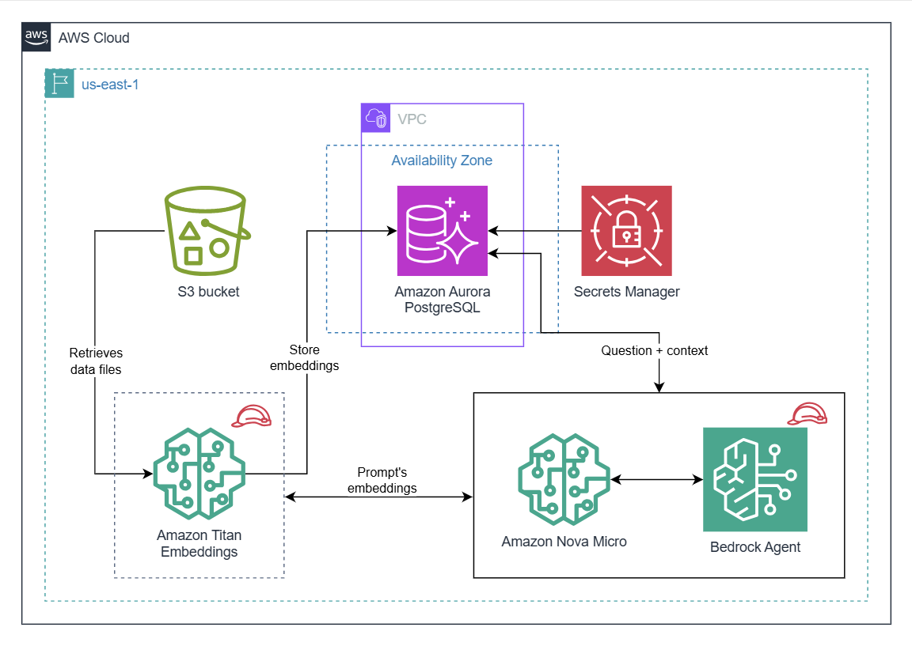

# Conversational RAG Agent with Amazon Bedrock

This project implements a **Conversational Agent** that combines Retrieval-Augmented Generation (RAG) with the orchestration capabilities of Amazon Bedrock Agents. It enables users to have multi-turn conversations where the agent can contextually search the knowledge base and provide accurate answers.

## Architecture

You can watch the [demo video here](https://youtu.be/JuZG2Y2Fa7A).

## Project Overview

Unlike a standard RAG system that simply retrieves and generates, this **Conversational Agent**:
1.  **Maintains Context**: Handles multi-turn interactions, remembering previous questions and answers.
2.  **Orchestrates Actions**: Uses Bedrock Agents to decide *when* to query the Knowledge Base versus handling the query directly.
3.  **Advanced Retrieval**: Utilizes a highly optimized vector store (Aurora PostgreSQL) with HNSW indexing.

## Technical Details

### 1. Vector Database (Amazon Aurora PostgreSQL)
The project uses Amazon Aurora Serverless with the `pgvector` extension to serve as the Knowledge Base.

- **Schema**: `bedrock_integration`
- **Table**: `bedrock_kb`
- **Embedding Dimensions**: `1024` (Optimized for higher precision embedding models).
- **Indexing**:
    - **HNSW (Hierarchical Navigable Small World)**: For ultra-fast approximate nearest neighbor vector search.
    - **GIN**: For efficient keyword/text search on chunks.

### 2. Bedrock Agent
The core orchestration engine that:
- Decomposes complex user queries.
- Interacts with the Knowledge Base.
- Generates natural language responses using the foundation model.

## Files Included

- `KnowledgeBase_SQLCommands.sql`: The SQL script to initialize the schema, table, extensions, and indexes. (Note the 1024-dimension vector column).
